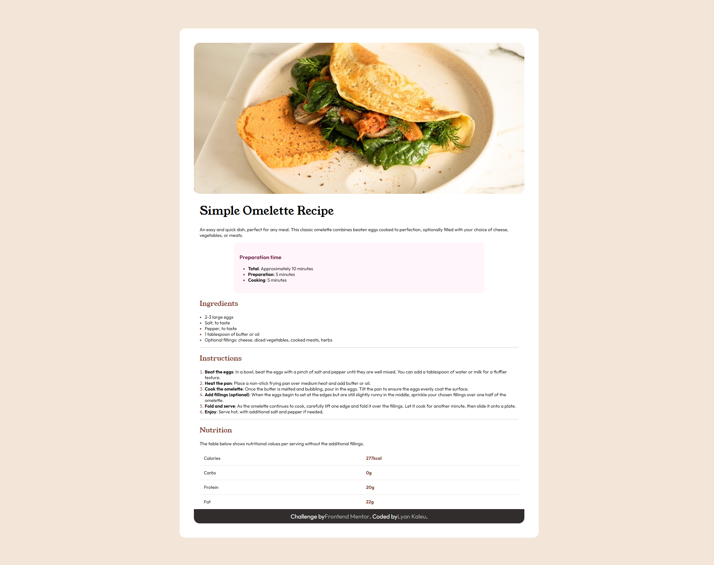

# Frontend Mentor - Recipe page solution

This is a solution to the [Recipe page challenge on Frontend Mentor](https://www.frontendmentor.io/challenges/recipe-page-KiTsR8QQKm). Frontend Mentor challenges help you improve your coding skills by building realistic projects. 

## Table of contents

- [Screenshot](#screenshot)
- [Links](#links)
- [Built with](#built-with)
- [What I learned](#what-i-learned)
- [Continued development](#continued-development)
- [Useful resources](#useful-resources)
- [Author](#author)
- [Acknowledgments](#acknowledgments)

### Screenshot



### Links

- Solution URL: [Add solution URL here](https://your-solution-url.com)
- Live Site URL: [Add live site URL here](https://your-live-site-url.com)

### Built with

- Visual Studio Code (source code editor)
- Semantic HTML5 markup
- CSS custom properties
- Flexbox
- Mobile-first workflow

### What I learned

While working on this project, I learned several important front-end development and responsive design techniques. Here are some of the key learnings:

#### 1. Media Queries for Responsiveness

Applying media queries is crucial to ensuring that your website design is responsive across different screen sizes. Here is an example of how I used media queries in my CSS:

```css
@media screen and (min-width: 1440px){
    body {
        background-color: var(--white);
        width: 50%;
        height: auto;
        border-radius: 20px;
        padding: 50px;
        margin: 100px auto;
        box-sizing: border-box;
    }

    html {
        background-color: var(--eggshell);
    }

    img {
        border-radius: 20px;
    }

    .attribution {
        border-radius: 0 0 20px 20px;
    }
}
```

#### 2. Element Centering

Centering elements on the page is essential for a visually pleasing appearance. Here is how I centered the main container on the screen:

```css
.attribution { 
    display: flex;
    align-items: center;
    justify-content: center;
    background-color: var(--dark-charcoal);
    color: var(--rose-white);
    font-size: 1.3rem; 
    text-align: center;
    height: 50px;
}
```

#### 3. CSS Variables

Using CSS variables facilitates design maintenance and consistency. Here is how I defined and used CSS variables throughout my project:

```css
:root {
    --nutmeg: hsl(14, 45%, 36%);
    --dark-raspberry: hsl(332, 51%, 32%);
    --white: hsl(0, 0%, 100%);
    --rose-white: hsl(330, 100%, 98%);
    --eggshell: hsl(30, 54%, 90%);
    --light-grey: hsl(30, 18%, 87%);
    --wenge-brown: hsl(30, 10%, 34%);
    --dark-charcoal: hsl(24, 5%, 18%);
}

body {
    font-family: "Outfit", sans-serif;
    font-size: 16px;
    background-color: var(--white); /* Example of using a variable */
}
```

### Continued development

- Animations and Transitions: I'm still exploring the possibilities of CSS animations and transitions to create more dynamic and interactive interfaces. I want to delve into advanced animation techniques like keyframes, SVG animations, and animation libraries like GreenSock (GSAP).

- API integration with JavaScript: I'm interested in improving my knowledge of modern JavaScript, including features like Promises, Async/Await, and delving into advanced concepts of DOM manipulation and event handling.

- React: While I'm not familiar with the basics of React, I'd like to delve into advanced topics like Context API, React Hooks, React Router, and more complex state management with Redux or MobX.

- CSS Grid and Flexbox: Although I have a basic understanding of Grid and Flexbox, I want to improve my skills to create more complex and responsive layouts more efficiently.

### Useful resources

- [GitHub](https://github.com) - For hosting and collaborating on open source projects, as well as being a great source of libraries and frameworks.
- [Stack Overflow](https://stackoverflow.com) - A community of developers that helps solve code problems and provides answers to technical questions.
- [Visual Studio Code](https://code.visualstudio.com) - A highly customizable and efficient code editor, with support for several programming languages and a wide range of extensions.
- [Chrome DevTools](https://developer.chrome.com/docs/devtools?hl=pt-br) - Set of tools integrated into the browser that help with the development and debugging of websites and web applications.
- [Figma](https://www.figma.com) - A powerful web-based collaborative design tool great for creating wireframes, prototypes, and high-fidelity designs.
- [MDN Web Docs](https://developer.mozilla.org/) - An excellent source of documentation for web technologies, including HTML, CSS, JavaScript and more.
- [Live Preview](https://marketplace.visualstudio.com/items?itemName=ms-vscode.live-server) - The Live Preview extension is an extremely useful tool for web developers working with Visual Studio Code. It allows you to view changes made to the code in real time, directly in the browser, without the need to manually refresh the page with each modification.

## Author

- Website - [Lyan Kaleu](https://portfolio-lyankaleu.vercel.app)
- Frontend Mentor - [@LyanKaleu](https://www.frontendmentor.io/profile/yourusername)
- LinkedIn - [Lyan Kaleu](www.linkedin.com/in/lyankaleu)

## Acknowledgments

I would like to express my sincere gratitude to Frontend Mentor for providing amazing website challenges that have been instrumental in practicing and improving my knowledge in front-end development. Each challenge offers a unique opportunity to apply concepts, explore new techniques, and develop practical coding skills. Additionally, the active and supportive community around Frontend Mentor is a constant source of inspiration and support. I am truly grateful for all the learning and growth I have gained through these challenges. Thank you, Frontend Mentor! 🙏🚀